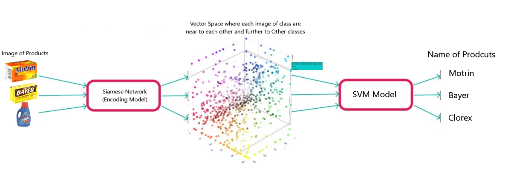

# Project README

## Project Overview

This project involves the development of a Siamese neural network trained using triplet loss metrics. The purpose of this network is to generate embedding vectors for images, which are then used to create a vector space where data separation is performed using a Support Vector Machine (SVM) with a Radial Basis Function (RBF) kernel. The RBF kernel was chosen due to its effectiveness in high-dimensional spaces.
## Siamese Network Triplet Loss
Siamese network that works on minimizing the distance between the photo *a* and the photos similar to it.

## Projects Pipeline

